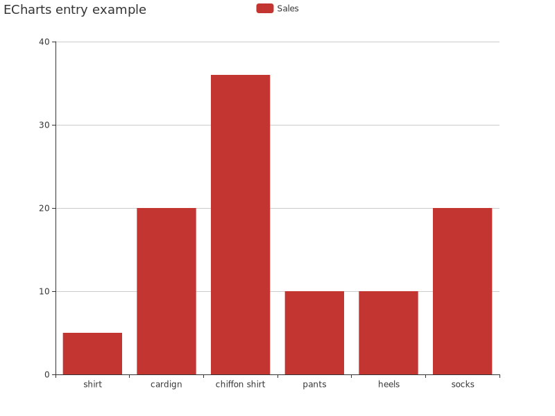

# echarts-ssr
echarts js server side rendering using node-canvas

## Table of Contents
- [Installation](#installation)
- [Quick Example](#quick-example)
- [API](#api)


## Installation
```bash
$ npm install echarts-ssr
```

## Quick Example
```javascript
const { Chart } = require('echarts-ssr');

const option = {
    title: {
        text: 'ECharts entry example'
    },
    backgroundColor: 'white',
    tooltip: {},
    legend: {
        data:['Sales']
    },
    xAxis: {
        data: ["shirt","cardign","chiffon shirt","pants","heels","socks"]
    },
    yAxis: {},
    series: [{
        name: 'Sales',
        type: 'bar',
        data: [5, 20, 36, 10, 10, 20]
    }]
};

const chart = new Chart(800, 600);
chart.renderToFileSync(option, 'render-to-file.png');
```


## API
### renderToBuffer
Render chart from canvas to buffer.
This method will return `Promise<Buffer>`
| Parameter Name| Description | Type | Default Value |
| --- | --- | --- | --- |
| option | Echarts option | `EChartOption` \| `EChartsResponsiveOption` |
| [autoDispose] | Auto dispose chart | `boolean` | `true` |

### renderToBufferSync
Synch render chart from canvas to buffer.
This method will return `Buffer`
| Parameter Name| Description | Type | Default Value |
| --- | --- | --- | --- |
| option | Echarts option | `EChartOption` \| `EChartsResponsiveOption` |
| [autoDispose] | Auto dispose chart | `boolean` | `true` |

### renderToFile
Render chart from canvas to file.
This method will return `Promise`
| Parameter Name| Description | Type | Default Value |
| --- | --- | --- | --- |
| option | Echarts option | `EChartOption` \| `EChartsResponsiveOption` |
| filename |  | `string` |
| [autoDispose] | Auto dispose chart | `boolean` | `true` |

### renderToFileSync
Synch render chart from canvas to buffer.
| Parameter Name| Description | Type | Default Value |
| --- | --- | --- | --- |
| option | Echarts option | `EChartOption` \| `EChartsResponsiveOption` |
| filename |  | `string` |
| [autoDispose] | Auto dispose chart | `boolean` | `true` |